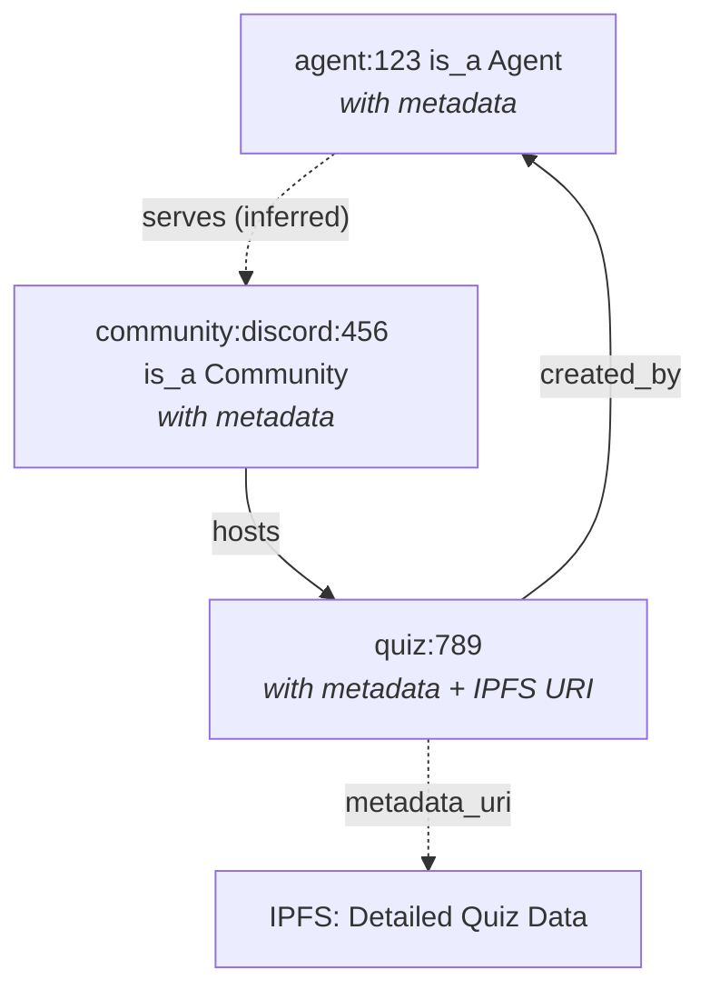

# Intuition Integration Design (2025-05-27) - Phased Implementation

## Phased Implementation Approach

The implementation will follow a two-phase approach:

1. **Phase 1: Contract Implementation**
   - Implement and validate the on-chain quiz contracts (QuizFactory and QuizEscrow)
   - Integrate contracts with the existing "/ask" command
   - Test and validate the full quiz lifecycle

2. **Phase 2: Intuition Integration**
   - Add Intuition integration using a one-phase recording approach
   - Record quiz data in Intuition only after quiz completion/expiry
   - Follow the minimal triple design outlined below

## Integration with Intuition MCP Server and Collab.Land Account Kit

After contract validation (Phase 2), the design integrates with:

1. **Intuition MCP Server** (github.com/0xintuition/intuition-mcp-server) for standardized knowledge graph interactions using the Model Context Protocol

2. **Collab.Land Account Kit SDK** for authentication, signing, and permissions management, eliminating the need for separate key management

```mermaid
graph TD
    subgraph "Collab.Land Infrastructure"
        AccountKit["Account Kit SDK"]
        UserAuth["User Authentication"]
        SigningService["Signing Service"]
    end
    
    subgraph "Quiz System"
        QuizManager["Quiz Manager"]
        MCPClient["MCP Client"]
        IPFSClient["IPFS Client"]
    end
    
    subgraph "External Services"
        MCPServer["Intuition MCP Server"]
        KnowledgeGraph["Knowledge Graph"]
    end
    
    QuizManager -->|"User identity & auth"| AccountKit
    QuizManager -->|"Record quiz activity"| MCPClient
    QuizManager -->|"Store detailed data"| IPFSClient
    
    AccountKit -->|"Authentication"| UserAuth
    AccountKit -->|"Content signing"| SigningService
    
    SigningService -->|"Sign IPFS content"| IPFSClient
    UserAuth -->|"Authorize access"| MCPClient
    
    MCPClient -->|"MCP protocol"| MCPServer
    MCPServer -->|"Store & query"| KnowledgeGraph
end
```

## Minimal Triple Structure Design

We've designed a minimalist yet powerful integration between the Quiz Agent and the Intuition knowledge graph that prioritizes efficiency while maintaining rich queryability.

### Core Entity Structure



### Triple Design

#### Entity Definition Triples
```javascript
// Define agent (once per agent)
{
  subject: `agent:${agentId}`,
  predicate: "is_a",
  object: {
    id: "Agent",
    metadata: { 
      name: "Quiz Bot", 
      version: "1.0",
      type: "QuizAgent"
    }
  }
}

// Define community (once per community)
{
  subject: `community:${communityId}`,
  predicate: "is_a",
  object: {
    id: "Community",
    metadata: { 
      name: "Discord Server",
      member_count: 1250
    }
  }
}
```

#### Relationship Triples
```javascript
// For each quiz (minimal data)
{
  subject: `quiz:${quizId}`,
  predicate: "created_by",
  object: `agent:${agentId}`
}

{
  subject: `community:${communityId}`,
  predicate: "hosts",
  object: `quiz:${quizId}`
}
```

### Off-Chain Storage

Detailed quiz data stored in IPFS:
- Questions and answer options
- Participant interactions and scores
- Reward distribution details
- Analytics and performance metrics

### Implementation Flow

#### Phase 1: Contract Implementation

1. **Contract Development**:
   - Develop QuizFactory.sol and QuizEscrow.sol contracts
   - Implement quiz creation, participant registration, and reward distribution

2. **Integration with "/ask" Command**:
   - Extend the existing "/ask" command to create on-chain quiz escrows
   - Leverage Account Kit for wallet interaction
   - Use quiz expiry mechanism for automatic reward distribution

3. **Validation and Testing**:
   - Test full quiz lifecycle: creation, participation, reward distribution
   - Ensure contract security and proper fund handling

#### Phase 2: Intuition Integration

1. **Initial Setup**:
   - Register agent entity once
   - Register community entities once

2. **After Quiz Completion**:
   - Generate and store complete quiz data (including participation statistics) in IPFS
   - Record minimal relationship triples in Intuition

3. **Query Examples**:
   - Find communities by topic: `?quiz has_topic "ethereum" . ?community hosts ?quiz`
   - Find agents by community (inferred): `?quiz created_by ?agent . ?community hosts ?quiz`
   - Count quizzes per community: `SELECT ?community COUNT(?quiz) WHERE { ?community hosts ?quiz }`

### Key Benefits

#### Phase 1 Benefits
1. **Focus on Core Functionality**: Validates quiz contract functionality before adding discovery features
2. **Simplified Testing**: Focuses on a single integration point initially
3. **Clear User Experience**: Users can create and participate in quizzes with rewards immediately

#### Phase 2 Benefits
1. **Minimal Storage Costs**: Stores only essential relationships in Intuition
2. **Rich Queryability**: Supports all key discovery use cases
3. **Flexible Schema**: Easy to extend with new entity types or relationships
4. **Separation of Concerns**: Detailed data off-chain, relationships on-chain
5. **Inference Support**: Derived relationships reduce triple count
6. **One-Phase Recording**: Records quiz data only after completion, minimizing transaction costs
7. **Complete Data**: Includes full participation statistics and reward distribution information
8. **Integrated Authentication**: Leverages Collab.Land Account Kit for identity and authorization
9. **Simplified Security**: Uses existing Account Kit signing capabilities instead of custom key management
10. **Role-Based Access**: Utilizes Discord roles through Account Kit for permission management
11. **Standardized Protocol**: Uses Model Context Protocol via Intuition MCP server
12. **Improved Interoperability**: Easier integration with AI systems and other MCP-compatible services
