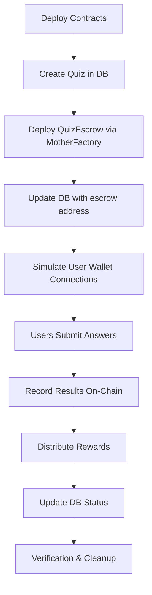

# Local Simulation Scripts Design

## Overview
Create simulation scripts that replicate the full Collab.Land Account Kit + Discord bot + smart contract workflow using Hardhat local network. These scripts will serve as blueprints for the actual Base Sepolia integration.

## Architecture

### 1. Hardhat Simulation Environment
- **Network**: Local Hardhat network with multiple signers
- **Contracts**: Deploy MotherFactory + QuizHandler + QuizEscrow using our deployment script
- **Database**: Use existing PostgreSQL database with real models
- **Account Kit Simulation**: Mock the Account Kit SDK interactions

### 2. Simulation Components

#### A. Mock Account Kit Service (`/contracts/scripts/simulation/mockAccountKit.js`)
- Simulates Collab.Land Account Kit SDK methods
- Maps Discord IDs to generated wallet addresses
- Handles wallet connection/disconnection events
- Tracks user authentication state

#### B. Quiz Lifecycle Simulator (`/contracts/scripts/simulation/quizLifecycle.js`)
- **Phase 1**: Quiz Creation & Deployment
- **Phase 2**: User Participation & Answer Submission
- **Phase 3**: Results Recording & Reward Distribution
- **Phase 4**: Database State Verification

#### C. Database Integration Layer (`/contracts/scripts/simulation/databaseIntegration.js`)
- Updates Quiz model with on-chain deployment data
- Records Answer submissions with transaction hashes
- Manages wallet mappings between Discord IDs and addresses
- Tracks funding and distribution status

### 3. Simulation Workflow



### 4. Script Structure

#### Main Simulation Script (`/contracts/scripts/simulate-quiz-lifecycle.js`)
```javascript
// Entry point that orchestrates the full simulation
// 1. Setup environment (deploy contracts, connect to DB)
// 2. Run quiz lifecycle simulation
// 3. Verify results and generate report
// 4. Cleanup (optional)
```

#### Individual Component Scripts
- `simulation/deployEnvironment.js` - Deploy contracts and setup
- `simulation/mockAccountKit.js` - Account Kit SDK simulation  
- `simulation/quizManager.js` - Quiz creation and management
- `simulation/userSimulator.js` - Simulate multiple users taking quiz
- `simulation/blockchainRecorder.js` - Record results on-chain
- `simulation/verificationSuite.js` - Verify database and contract state

### 5. Mock User Scenarios

#### Scenario 1: Happy Path
- 3 users with different wallet addresses
- Mix of correct and incorrect answers
- All users receive appropriate rewards
- Database accurately reflects on-chain state

#### Scenario 2: Edge Cases
- User disconnects wallet mid-quiz
- Quiz expires before some users finish
- Insufficient funds for rewards
- Failed transaction scenarios

#### Scenario 3: Scale Testing
- 10+ concurrent users
- Multiple quizzes running simultaneously
- Stress test database updates and contract interactions

### 6. Database Verification Points

#### Quiz Model Updates
- `escrowAddress` populated after deployment
- `transactionHash` recorded for deployment
- `onChain` flag set to true
- `fundingStatus` transitions: unfunded → funded → distributed
- `expiryTime` matches contract expiry

#### Answer Model Updates  
- `userWalletAddress` populated from Account Kit simulation
- `transactionHash` recorded for on-chain submission
- `onChain` flag set to true after blockchain recording
- `isCorrect` matches actual quiz answers

#### WalletMapping Model
- Discord ID to wallet address mappings created
- Addresses match those used in smart contract interactions

### 7. Integration Points with Real System

#### Account Kit Compatibility
- Use same method signatures as real Account Kit SDK
- Emit same events (wallet connected, disconnected, etc.)
- Return data in same format as real SDK

#### Discord Bot Compatibility  
- Scripts can be called from existing bot commands
- Database models remain unchanged
- Blockchain service interface stays consistent

#### Contract Interface Consistency
- Use actual deployed contract addresses and ABIs
- Call same methods that will be used in production
- Handle same error conditions and edge cases

### 8. Success Criteria

#### Functional Requirements
- ✅ Complete quiz lifecycle executes without errors
- ✅ Database state matches smart contract state at all checkpoints
- ✅ All user scenarios complete successfully
- ✅ Reward distribution works correctly
- ✅ Error handling scenarios behave as expected

#### Performance Requirements
- ✅ Scripts execute in under 5 minutes for standard scenarios
- ✅ Handle 10+ concurrent users without database conflicts
- ✅ Memory usage remains stable during execution

#### Documentation Requirements
- ✅ Clear usage instructions for each script
- ✅ Error troubleshooting guide
- ✅ Integration guide for Base Sepolia migration

### 9. Output and Reporting

#### Simulation Report
- Execution summary with timings
- Database state before/after comparison
- Contract event logs and transaction details
- User interaction statistics
- Error logs and debugging information

#### Reference Documentation
- Code examples for Account Kit integration
- Database update patterns
- Smart contract interaction patterns
- Error handling best practices

This simulation framework will provide confidence that our contracts, database models, and integration patterns work correctly before deploying to Base Sepolia and integrating with the real Collab.Land Account Kit.
